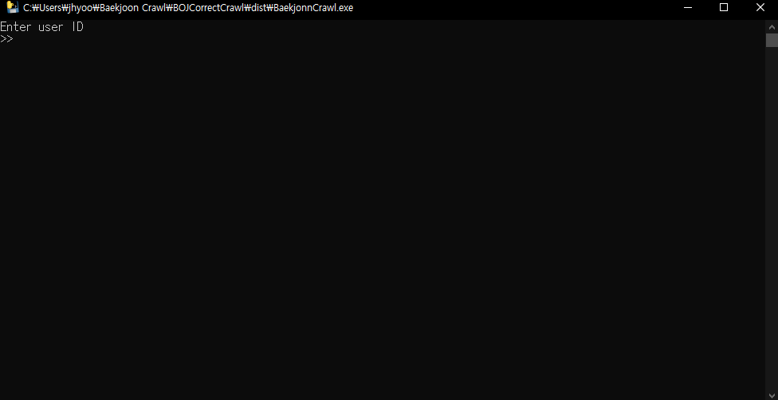
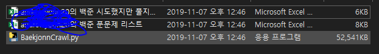

BOJ Correct Incorrect Crawl
===
***

- What for? : [백준 온라인저지](https://www.acmicpc.net/)에서 사용자가 맞은 문제들과 틀린문제들의 리스트를  엑셀로 출력해주는 프로그램입니다.

- Language : Python 3.7

- ENV : JetBrain Pycharm, Windows 10

- Used Modules : pandas, bs4, urllib, pyinstaller(to make exe file)

- .exe file link : [here](https://drive.google.com/open?id=1LI1gXFG3z0zEue3sSu1lehAqXPJVqLQ5)

- pyinstaller command to make CLI to exe : pyinstaller -F BaekjonnCrawl.py -n BaekjonnCrawl.py

***

- 2019/11/20

    - Make time sync columns : The most recent crawl date is now entered.

    - Now, if you have data for an existing user, it's not about creating new data and replacing it, but rather merging data that's not there compared to the existing data. This is to counteract the 'Updated Time' column.

***

### How to Use?

- First when you open the program CLI will open like this.

    
    


- Next enter your Baekjoon Online judge's ID(Nickname).


- When you enter your name properly excel files will be generated in directory of this program.


   

- Code of this program

```python
from urllib.request import URLError
from urllib.request import HTTPError
from urllib.request import urlopen
from bs4 import BeautifulSoup
import pandas as pd
import numpy as np
import os
import sys
import time
import warnings
warnings.filterwarnings(action='ignore')

now = time.localtime()
#기존 데이터 존재여부
before_data_exist = False
#기존 데이터가 있던 경우에 사용
new_solved = []
#기존데이터가 있던 경우 기존데이터대입
prev_data = None

def naviagableStringToNormalString(li,):
    resultList = []
    for navigableSt in li.children:
        resultList.append(navigableSt.string)
    resultList = list(filter(('\n').__ne__, resultList))
    return resultList


def makeDataFrame(li,index):
    frameData = pd.DataFrame(columns=['Question Number', 'Question Tite', 'Question URL','Updated Time'])
    loopCount = len(li) / 2
    varCount = 0
    questionCount = 1
    while (varCount < loopCount):
        df = pd.DataFrame(
            data={'Question Number': li[varCount], 'Question Tite': li[varCount + 1],
                  'Question URL': problemURL + str(li[varCount]),
                  'Updated Time' : "%04d-%02d-%02d %02d:%02d:%02d" % (now.tm_year, now.tm_mon, now.tm_mday, now.tm_hour, now.tm_min, now.tm_sec)},
            index=[questionCount])
        if varCount == 0:
            frameData = df
        else:
            frameData = pd.concat([frameData, df])
        loopCount += 1
        varCount += 2
        questionCount += 1
    if index == 0:
        frameData.to_excel(name + '의 백준 푼문제 리스트' + '.xlsx')
        print("Complete to make Correct question list excel file ( 1 / 2 )")
    elif index == 1:
        frameData.to_excel(name + '의 백준 시도했지만 풀지못한문제 리스트' + '.xlsx')
        print("Complete to make InCorrect question list excel file ( 2 / 2 )")

def add_New(li):
    frameData = pd.DataFrame(columns=['Question Number', 'Question Tite', 'Question URL', 'Updated Time'])
    loopCount = len(li) / 2
    varCount = 0
    questionCount = list(prev_data.index)[-1] + 1
    while varCount < loopCount:
        df = pd.DataFrame(
            data={'Question Number': li[varCount], 'Question Tite': li[varCount + 1],
                  'Question URL': problemURL + str(li[varCount]),
                  'Updated Time': "%04d-%02d-%02d %02d:%02d:%02d" % (
                  now.tm_year, now.tm_mon, now.tm_mday, now.tm_hour, now.tm_min, now.tm_sec)},
            index=[questionCount])
        if varCount == 0:
            frameData = df
        else:
            frameData = pd.concat([frameData, df])
        loopCount += 1
        varCount += 2
        questionCount += 1
    new_sync_data = pd.concat([prev_data,frameData])
    new_sync_data.to_excel(name + '의 백준 푼문제 리스트' + '.xlsx')

userURL = 'https://www.acmicpc.net/user/'
problemURL = 'https://www.acmicpc.net/problem/'

try:
    print("Enter user ID")
    name = input(">>")
    userURL = userURL + name
    html = urlopen(userURL)
    bs = BeautifulSoup(html, 'html.parser')
except TypeError:
    print("Type Error. Write ID with String Type")
    sys.exit()
except HTTPError as e:
    print(e)
    sys.exit()
except URLError as e:
    print(e)
    sys.exit()

li = bs.findAll('div',{'class' :'panel-body'})[0]#.find('span',{'class' : 'problem_number'})
li2 = bs.findAll('div',{'class' : 'panel-body'})[1]

CorrectIncorrect = []
#맞은문제에 대해

li1StringOnly = naviagableStringToNormalString(li)
CorrectIncorrect.append(li1StringOnly)

#틀린문제에 대해
li2StringOnly = naviagableStringToNormalString(li2)
CorrectIncorrect.append(li2StringOnly)

program_dir = os.getcwd()
xl_list = os.listdir(program_dir)
# 확장자가 .xlsx(Microsoft Excel File)인 파일들만 리스트로 출력해서 파일 확인하기
xl_list = [file for file in xl_list if file.endswith("의 백준 푼문제 리스트.xlsx")]


for t in range(0,len(xl_list)):
    if name == xl_list[t].split(' ')[0].split('의')[0]:
        before_data_exist = True
        prev_data = pd.read_excel(name + '의 백준 푼문제 리스트' + '.xlsx',index_col = 0)
        prev_data_Qlist = list(prev_data['Question Number'])
        for n in range(0, len(li1StringOnly), 2):
            if int(li1StringOnly[n]) not in prev_data_Qlist:
                new_solved.append(int(li1StringOnly[n]))
                new_solved.append(li1StringOnly[n+1])
            else:
                continue
        del CorrectIncorrect[0]
        CorrectIncorrect.insert(0, new_solved)
        break
    else:
        continue

for cot in range(0, len(CorrectIncorrect)):
    if cot == 0 and before_data_exist == True:
        add_New(CorrectIncorrect[cot])
    else:
        makeDataFrame(CorrectIncorrect[cot],cot)

print('Comlete to make files')
os.system("pause")

```


